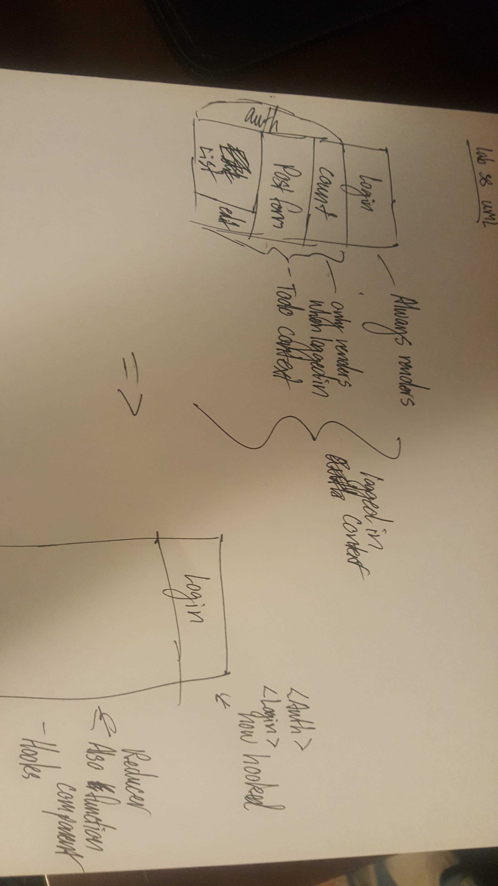

# Lab38 Spencer Hirata

- [Code sandbox](https://codesandbox.io/s/m9oz91vmmy)
- [PR](https://github.com/shiratap/Lab38/pull/2)

### Login/Auth System

- [x] Convert the `<Login />` and `<Auth />` components from classes to functional components
- [x] Implement the `useContext()` hook to tap into the Login Context
- [x] Use the `useState()` hook in the `<Login />` component to manage form state as the user types.

### To Do Component

Note that this component is protected by the `<Auth />` system, so make sure that this functionality remains intact.

- [x] Convert from class to a function component
- [ ] Use the `useReducer()` hook to manage the To Do List items list
- [ ] Use the `useState()` hook to manage the form

- I need so much help on this section

